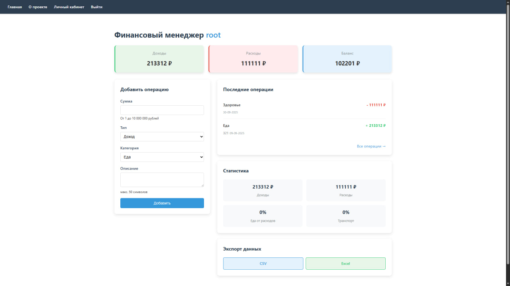
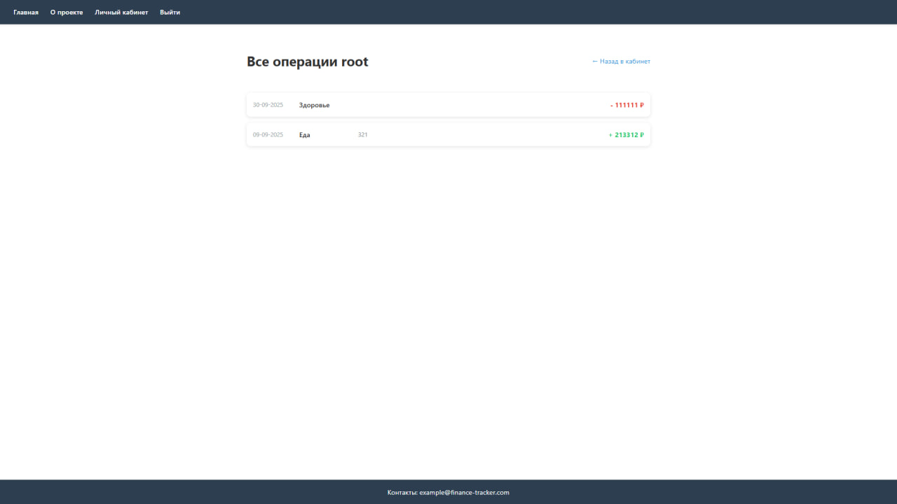

# Finance Tracker - Персональный финансовый менеджер

Система для учёта личных финансов с аналитикой и экспортом данных.

## 📌 Основной функционал

### 💰 Управление транзакциями
- Добавление доходов/расходов
- Просмотр истории операций
- Удаление транзакций
- Категоризация (еда, транспорт, зарплата и др.)

### 📊 Аналитика
- Общий баланс (доходы - расходы)
- Статистика
- Распределение расходов по категориям (%)
- Последние 4 операции на главной

### 🔐 Безопасность
- Регистрация с валидацией паролей:
  - Минимум 8 символов
  - Обязательные цифры и спецсимволы
- Защищённые сессии с куками
- Хеширование паролей (bcrypt)

### 📁 Экспорт данных
- Скачивание в CSV
- Скачивание в Excel (XLSX)
- Автоформатирование файлов

## 🖼️ Визуализация интерфейса

### Личный кабинет

*В личном кабинете отображается текущий баланс, статистика и последние транзакции*

### История транзакций

*Интерфейс для просмотра и удаления финансовых операций*

## 🛠 Технологический стек
- **Python**: Python 3.12.3
- **Backend**: Python + FastAPI
- **Frontend**: Jinja2 + HTML/CSS (без JavaScript)
- **База данных**: SQLite
- **Аутентификация**: Сессии + куки

## 🚀 Запуск проекта (terminal)
- python run.py
- uvicorn app.main:app --reload

### Требования
- Python 3.8+
- Установленные зависимости из `requirements.txt`